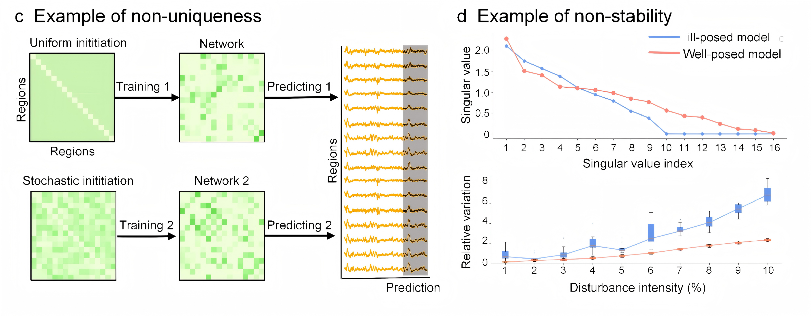

# Artificial Intelligence as a Surrogate Brain

This repository contains the open-source implementation of the paper:  
**_Artificial Intelligence as a Surrogate Brain: Bridging Neural Dynamical Models and Data_**.


---

## Updates

- **2025/10/14**: Paper published on [arXiv](https://arxiv.org/abs/2510.10308)
- **2025/10/10**: Paper accepted by *National Science Review*
- **2025/08/21**: Code released

---

## Environment Setup

To set up the environment, create a new conda environment and install the required dependencies by running the following commands:

`conda env create -f environment.yml`

`conda activate surrogate_brain`

---

## Dataset

Due to the large size of the training dataset, it cannot be stored directly on GitHub.  
You can download it from Zenodo using the following link:

[Zenodo Download: https://zenodo.org/records/16915601](https://zenodo.org/records/16915601)

The dataset originates from the **OpenNeuro HUP iEEG dataset** [1].  
We provide a simplified and preprocessed version tailored for training the surrogate brain models.

- **Dataset source**:  
  [1] Kini L. G., Bernabei J. M., Mikhail F., et al. **Virtual resection predicts surgical outcome for drug-resistant epilepsy**. *Brain*, 2019, 142(12): 3892–3905.

---

## Quick Training and Testing

A demo file is provided to train and evaluate the surrogate brain toy model.  
You can run it by executing the following command in:

`cd surrogate_brain_toy_model`

`python demo.ipynb`

To run the full training process, execute the following command:

`cd surrogate_brain_toy_model`

`python run_main.py`


### Model Options
You can choose from the following models for training:
- RNN
- Low-Rank RNN
- dend-PLRNN
- EI-RNN

### Evaluation Metrics
The model is evaluated from 5 different angles, using 10 different metrics:

1. **Error metrics in state space**:  
   - Mean Squared Error (MSE)  
   - Mean Absolute Error (MAE)

2. **Metrics in probability space**:  
   - Kullback-Leibler Divergence (KL Divergence)  
   - Hellinger Distance

3. **Goodness of fit**:  
   - Explained Variance (EV)  
   - R-squared (R²)

4. **Functional similarity**:  
   - Spectral Similarity  
   - Functional Connectivity Similarity

5. **Topological similarity**:  
   - Persistent Homology Wasserstein Distance  
   - Fractal Dimension Similarity

## More 

We also provide visualization code for the Example of Ill-posedness (Figure 3) and Evaluation of Surrogate Brain (Figure 4) from the paper. Please refer to the `/figure_3` and `/figure_4` folders for the corresponding code.

### Example of Ill-posedness (Figure 3)



*Example of non-uniqueness and instability.*

### Evaluation of Surrogate Brain (Figure 4)


*Model evaluation from mathematical and neuroscientific perspectives.*

---
## Citations
If you find our work useful, please consider citing:
```bibtex
@misc{zhang2025artificialintelligencesurrogatebrain,
  title={Artificial Intelligence as a Surrogate Brain: Bridging Neural Dynamical Models and Data},
  author={Yinuo Zhang and Demao Liu and Zhichao Liang and Jiani Cheng and Kexin Lou and Jinqiao Duan and Ting Gao and Bin Hu and Quanying Liu},
  year={2025},
  eprint={2510.10308},
  archivePrefix={arXiv},
  primaryClass={q-bio.NC},
  url={https://arxiv.org/abs/2510.10308},
}

